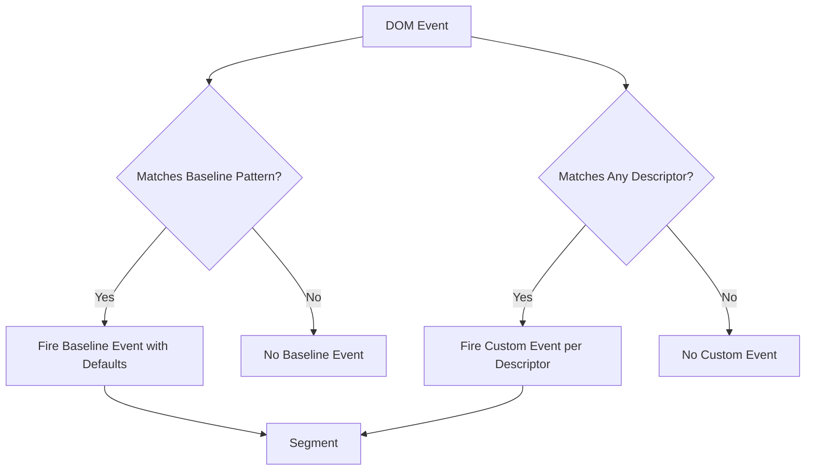
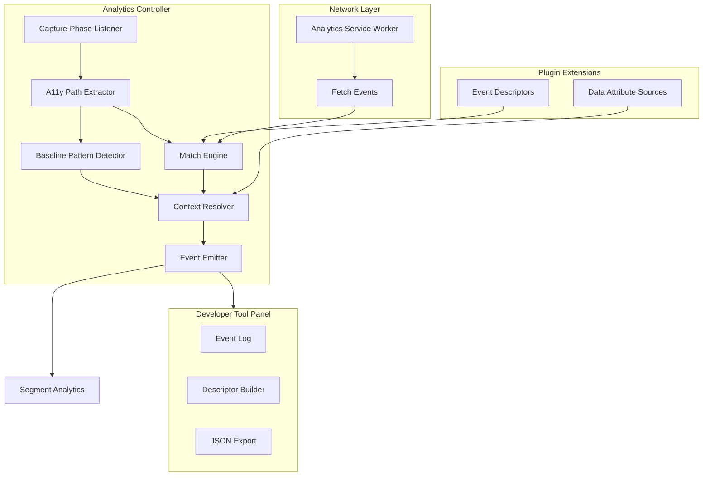

# Automatic Event Capture POC (RHOAIENG-38686)

This spike implements a proof-of-concept for automatic event tracking that captures UI interactions via DOM inspection and API operations via network interception. Developers use a dev tool to discover events and create descriptors that are evaluated at runtime.

## Key Design Decisions

| Decision | Rationale |
|----------|-----------|
| **Event descriptors (not definitions)** | JSON artifacts created via dev tool, loaded at runtime via extension registry |
| **A11y-first matching** | Like React Testing Library - prefer role, accessible name, region over CSS selectors |
| **Flexible match conditions** | Array of conditions with AND semantics; any attribute can match |
| **Glob patterns in matches** | Support `Deploy *` to match `Deploy model`, `Deploy runtime` |
| **Context sources for values only** | Data-attribute sources provide values; matching is separate |
| **Dev mode broad capture** | Capture all interaction events plus non-GET network requests for inspection; prod only captures what descriptors need |
| **Multiple descriptors can fire** | If multiple descriptors match the same event, all fire |
| **Minimal base properties** | Only `pathname`, `clusterID` auto-included |
| **Minimal transforms** | Only `hash` and `boolean` transforms supported |
| **Baseline auto-tracking** | Common patterns (primary buttons, modals, forms) tracked automatically with defaults; descriptors can customize |
| **Interactive elements only** | Click events only captured on interactive elements (buttons, links, inputs, etc.) - clicking random text is ignored |
| **No GET request tracking** | Network tracking excludes GET requests - only mutating operations (POST, PUT, PATCH, DELETE) indicate user intent |

## Baseline "Always Capture" Interaction Set

The system automatically tracks a **baseline set of common UI interactions** without requiring explicit descriptors. This ensures consistent coverage and avoids gaps from manual instrumentation.

### Baseline Patterns

| Pattern | What Gets Tracked | Default Event Name |
|---------|-------------------|-------------------|
| **Primary actions** | Primary CTA buttons (e.g., PatternFly `Button variant="primary"`) | `{area}.primaryAction` |
| **Overflow/menu actions** | Kebab menu opens and item selections | `{area}.menuAction` |
| **Modal lifecycle** | Modal open and close, including close reason (cancel vs submit) | `modal.opened`, `modal.closed` |
| **Form lifecycle** | Form entry/start and exit/end with outcome (submitted vs cancelled) | `form.started`, `form.completed` |
| **Validation errors** | Inline validation failures (sanitized, no PII) | `validation.error` |

### How Baseline Works with Descriptors



**Key behaviors:**

1. **Baseline fires automatically** - No descriptor needed for common patterns
2. **Descriptors can override** - Create a descriptor with same trigger to customize event name/properties
3. **Both can fire** - A primary button click can fire both baseline event AND custom descriptor events
4. **Context is included** - Baseline events include available context (area, region, etc.)

### Baseline Detection (Implementation Detail)

Detection will use a combination of approaches (to be refined during implementation):

- **PatternFly-aware**: Recognize PF component classes/structures (e.g., `pf-v5-c-button--primary`, `pf-v5-c-modal-box`)
- **ARIA role-based**: Detect by `role="dialog"`, `role="form"`, etc.
- **Data attributes**: Look for `data-ouia-component-type` or similar markers

### Baseline Event Properties

All baseline events include:

| Property | Source | Description |
|----------|--------|-------------|
| `baselinePattern` | Detection | Which pattern triggered (e.g., `primaryButton`, `modalClose`) |
| `elementName` | A11y | Accessible name of the element |
| `area` | Context | Nearest area/region context |
| `outcome` | Detection | For forms/modals: `submitted`, `cancelled`, `abandoned` |

### Stable Event Identifiers

Every automatically captured baseline event is assigned a **stable unique identifier** based on its characteristics. This ID can be used by extensions to target, disable, or override specific events.

**ID Generation Pattern:**

```
baseline.{pattern}.{region}.{elementName}
```

The URL is **not** included in the ID - it's available as the `pathname` property on the event for filtering in Amplitude.

**Examples:**

| Event | Generated ID |
|-------|--------------|
| Primary button "Create project" in Projects area | `baseline.primaryButton.projects.create-project` |
| Modal close in Model Serving area | `baseline.modalClose.model-serving.deploy-model-modal` |
| Form submit in Projects area | `baseline.formSubmit.projects.create-project-form` |

The ID is deterministic - the same interaction always produces the same ID, making it stable across releases.

### Event Override Extension

**Extension Type:** `app.analytics/event-override`

Plugins can register overrides to modify or disable specific baseline events:

```typescript
type EventOverride = {
  /** The stable ID of the event to override */
  targetEventId: string;
  
  /** Disable this event entirely */
  disabled?: boolean;
  
  /** Override the event name */
  eventName?: string;
  
  /** Additional properties to include (cannot modify base properties) */
  properties?: Record<string, PropertyMapping>;
};
```

**Example - Disable a baseline event:**

```json
{
  "type": "app.analytics/event-override",
  "properties": {
    "targetEventId": "baseline.primaryButton.projects.create-project",
    "disabled": true
  }
}
```

**Example - Override event name and add properties:**

```json
{
  "type": "app.analytics/event-override",
  "properties": {
    "targetEventId": "baseline.primaryButton.projects.create-project",
    "eventName": "Project Creation Initiated",
    "properties": {
      "hasExistingProjects": { "source": "context", "path": "hasProjects", "transform": "boolean" },
      "projectCount": { "source": "context", "path": "projectCount" }
    }
  }
}
```

### Customizing with Full Descriptors

Alternatively, create a full descriptor that matches the same interaction. This fires **in addition to** the baseline event (unless the baseline is disabled via override):

```json
{
  "schemaVersion": 1,
  "id": "projects.createButton.clicked",
  "eventName": "Create Project Clicked",
  "trigger": {
    "type": "interaction",
    "urlPattern": "/projects",
    "eventType": "click",
    "match": [
      { "type": "role", "value": "button" },
      { "type": "name", "value": "Create project" }
    ]
  },
  "properties": {
    "userHasExistingProjects": { "source": "context", "path": "hasProjects", "transform": "boolean" }
  }
}
```

## Developer Workflow

The core workflow is **"capture first, define later"**:

```mermaid
flowchart LR
    subgraph discovery [Discovery Mode]
        A[Enable Dev Tool] --> B[Perform Interactions]
        B --> C[View Raw Event Log]
        C --> D[Expand Event Details]
    end
    
    subgraph definition [Descriptor Creation]
        D --> E[Click Create Descriptor]
        E --> F[Edit Event Name]
        F --> G[Select Match Conditions]
        G --> H[Select Properties]
        H --> I[Configure Transforms]
        I --> J[Export JSON]
    end
    
    subgraph runtime [Production Runtime]
        J --> K[Register as Extension]
        K --> L[Event Occurs]
        L --> M[Match Against Descriptors]
        M --> N[Extract Properties]
        N --> O[Fire to Segment]
    end
```



### Workflow Steps

1. **Enable dev tool** - Run `debugAnalytics()` in browser console (dev builds only)
2. **Perform interactions** - Click buttons, submit forms, trigger API calls
3. **View raw events** - Dev tool shows summary with expandable details for each captured event
4. **Select an event** - Find the interaction you want to track
5. **Create descriptor** - Opens builder UI with all captured data pre-populated
6. **Customize** - Edit event name, select which match conditions to use, pick properties
7. **Export JSON** - Download descriptor file
8. **Register** - Add descriptor to plugin extension registry

## Architecture Overview



## 1. Event Descriptor Schema

Descriptors are JSON artifacts registered via the extension registry. They define what to track and how to extract properties.

**Extension Type:** `app.analytics/event-descriptor`

```typescript
type EventDescriptor = {
  /** Schema version for forward compatibility */
  schemaVersion: 1;

  /** Namespaced unique ID: e.g., "modelServing.deploy.clicked" */
  id: string;

  /** Event name sent to Segment */
  eventName: string;

  /** Trigger definition */
  trigger: InteractionTrigger | NetworkTrigger;
  
  /** Property mappings */
  properties: Record<string, PropertyMapping>;
};
```

### Interaction Trigger

```typescript
type InteractionTrigger = {
  type: 'interaction';
  
  /** React Router style URL pattern: /projects/:projectId/models */
  urlPattern: string;
  
  /** DOM event type */
  eventType: 'click' | 'submit' | 'change' | 'keydown';
  
  /** Match conditions - ALL must match (AND semantics) */
  match: MatchCondition[];
};
```

### Network Trigger

```typescript
type NetworkTrigger = {
  type: 'network';
  
  /** React Router style URL pattern: /api/namespaces/:ns/projects */
  urlPattern: string;
  
  /** HTTP method (GET excluded - read operations don't indicate user intent) */
  method: 'POST' | 'PUT' | 'PATCH' | 'DELETE';
  
  /** Response status pattern */
  statusPattern?: '2xx' | '4xx' | '5xx' | number;
};
```

**Note:** GET requests are intentionally excluded from network tracking. Read operations (fetching data) don't indicate meaningful user actions - they happen constantly in the background. Only mutating operations (POST, PUT, PATCH, DELETE) represent intentional user actions worth tracking.

### Match Conditions

Match conditions form an array with AND semantics. All conditions must match for the descriptor to fire. Values support glob patterns (e.g., `Deploy *`).

```typescript
type MatchCondition =
  | { type: 'role'; value: string }              // ARIA role
  | { type: 'name'; value: string }              // Accessible name (aria-label, textContent)
  | { type: 'region'; value: string }            // Nearest aria region label
  | { type: 'landmark'; value: string }          // main, navigation, banner, contentinfo
  | { type: 'heading'; value: string }           // Nearest heading text
  | { type: 'attribute'; attr: string; value: string }  // Any attribute
  | { type: 'testId'; value: string };           // Shorthand for data-testid
```

### Match Condition Types

| Type | Description | Example |
|------|-------------|---------|
| `role` | ARIA role of the element | `{ type: 'role', value: 'button' }` |
| `name` | Accessible name from aria-label or textContent | `{ type: 'name', value: 'Deploy model' }` |
| `region` | Label of nearest ancestor with `role="region"` | `{ type: 'region', value: 'Model Serving' }` |
| `landmark` | ARIA landmark type | `{ type: 'landmark', value: 'main' }` |
| `heading` | Text of nearest heading ancestor | `{ type: 'heading', value: 'Models' }` |
| `attribute` | Any HTML attribute | `{ type: 'attribute', attr: 'data-testid', value: 'deploy-btn' }` |
| `testId` | Shorthand for `data-testid` | `{ type: 'testId', value: 'deploy-btn' }` |

### Property Mapping

```typescript
type PropertyMapping = {
  /** Where to get the value */
  source: 'element' | 'a11y' | 'urlParam' | 'request' | 'response' | 'context' | 'literal';
  
  /** Dot-path to extract value */
  path: string;
  
  /** Optional transform */
  transform?: 'hash' | 'boolean';
  
  /** Fallback if extraction fails */
  default?: string | number | boolean;
};
```

### Property Sources

| Source | Description | Example Path |
|--------|-------------|--------------|
| `element` | Attribute from the event target | `dataset.modelId`, `ariaLabel` |
| `a11y` | From computed a11y path | `name`, `role`, `region`, `heading`, `landmark` |
| `urlParam` | Parameter from URL pattern match | `projectId`, `modelId` |
| `request` | From network request | `body.metadata.name`, `headers.content-type` |
| `response` | From network response | `body.metadata.uid`, `status` |
| `context` | From registered context source | `modelId`, `runtimeType` |
| `literal` | Static value | (use `default` instead of `path`) |

### Example Descriptors

**Interaction event - Deploy model button:**

```json
{
  "schemaVersion": 1,
  "id": "modelServing.deploy.clicked",
  "eventName": "Model Deploy Clicked",
  "trigger": {
    "type": "interaction",
    "urlPattern": "/projects/:projectId/modelServing",
    "eventType": "click",
    "match": [
      { "type": "role", "value": "button" },
      { "type": "name", "value": "Deploy model" },
      { "type": "region", "value": "Model Serving" }
    ]
  },
  "properties": {
    "modelId": { "source": "context", "path": "modelId" },
    "projectId": { "source": "urlParam", "path": "projectId" },
    "region": { "source": "a11y", "path": "region" },
    "heading": { "source": "a11y", "path": "heading" }
  }
}
```

**Network event - Project created:**

```json
{
  "schemaVersion": 1,
  "id": "project.created",
  "eventName": "Project Created",
  "trigger": {
    "type": "network",
    "urlPattern": "/api/namespaces/:namespace/projects",
    "method": "POST",
    "statusPattern": "2xx"
  },
  "properties": {
    "resourceId": { "source": "response", "path": "body.metadata.uid" },
    "outcome": { "source": "literal", "path": "", "default": "success" }
  }
}
```

## 2. A11y Path Extraction

For each DOM event, compute the semantic path to the element using accessibility tree information.

### What Gets Extracted

```typescript
type A11yPath = {
  /** Element's ARIA role (or implicit role from tag) */
  role: string;
  
  /** Accessible name (aria-label, aria-labelledby, or textContent) */
  name: string;
  
  /** Landmark ancestor (main, navigation, banner, contentinfo) */
  landmark?: string;
  
  /** Nearest region with label */
  region?: string;
  
  /** Nearest heading text */
  nearestHeading?: string;
  
  /** Full semantic path for debugging */
  semanticPath: string;  // e.g., "main > region[Model Serving] > button[Deploy model]"
};
```

### Example

For this DOM:

```html
<main>
  <section aria-label="Model Serving">
    <h2>Models</h2>
    <div data-model-id="llama-3">
      <button aria-label="Deploy model">Deploy</button>
    </div>
  </section>
</main>
```

The a11y path for the button click would be:

```typescript
{
  role: 'button',
  name: 'Deploy model',
  landmark: 'main',
  region: 'Model Serving',
  nearestHeading: 'Models',
  semanticPath: 'main > region[Model Serving] > button[Deploy model]'
}
```

## 3. Context Sources

Context sources provide **values only** - they don't participate in matching. When an event fires, all registered context sources are evaluated and their values are collected for property mapping.

### Data Attribute Context Source

**Extension Type:** `app.analytics/context-source/data-attribute`

Reads custom `data-*` attributes from DOM ancestors. Purely declarative.

```typescript
type DataAttributeContextSource = {
  /** Unique identifier - this IS the key for property mapping */
  id: string;
  
  /** The data attribute name (without 'data-' prefix) */
  dataAttribute: string;
};
```

### Attribute Resolution Rules

**1. Nearest Wins (Default)**

When multiple ancestors have the same attribute, the closest one is used:

```html
<div data-model-id="outer">
  <div data-model-id="inner">
    <button>Click</button>  <!-- event target -->
  </div>
</div>
```

Result: `modelId = "inner"` (nearest ancestor)

**2. Array Indexing**

Use `[n]` to target a specific occurrence (0 = nearest, 1 = second nearest, etc.):

```typescript
{ source: 'context', path: 'modelId' }      // nearest (same as [0])
{ source: 'context', path: 'modelId[0]' }   // nearest
{ source: 'context', path: 'modelId[1]' }   // second nearest ("outer")
```

**3. JSON Attribute Parsing**

If an attribute contains JSON, use dot notation to extract values:

```html
<div data-track='{"area": "projects", "action": "create"}'>
  <button>Create</button>
</div>
```
```typescript
// Context source registration
{ id: 'track', dataAttribute: 'track' }

// Property mapping with dot notation
{ source: 'context', path: 'track.area' }    // yields "projects"
{ source: 'context', path: 'track.action' }  // yields "create"
```

### Example

```typescript
// Extension registration
{
  type: 'app.analytics/context-source/data-attribute',
  properties: {
    id: 'modelId',
    dataAttribute: 'model-id'
  }
}

// In component
<div data-model-id="llama-3-8b-instruct">
  <button>Deploy model</button>
</div>

// In descriptor property mapping
{ source: 'context', path: 'modelId' }  // yields "llama-3-8b-instruct"
```

### Context Collection

When an event fires:

1. Walk up the DOM from event target to document root
2. For each ancestor, check all registered data-attribute sources
3. **Nearest wins**: The first (closest) matching attribute value is used
4. Collect values into context object (keyed by source `id`)
5. Make all values available for property mapping

## 4. Base Properties

These properties are automatically included in **every** event (minimal set):

| Property | Source | Description |
|----------|--------|-------------|
| `pathname` | React Router matched route | Route pattern (e.g., `/projects/:projectId/models`) |
| `clusterID` | Redux state | OpenShift cluster identifier |

## 5. Service Worker for Network Tracking

**Location:** `packages/analytics/src/service-worker/`

### Dev Mode vs Production Mode

| Mode | Behavior |
|------|----------|
| **Dev mode** | Capture non-GET/HEAD requests and full request/response bodies for dev tool inspection |
| **Production** | Only intercept URLs matching registered network descriptors; only extract referenced paths |

### Files to Create

- `analyticsServiceWorker.ts` - Service worker implementation
- `registerAnalyticsWorker.ts` - Registration logic
- `networkEventChannel.ts` - Message channel for events

### Capabilities

- Intercept fetch requests
- Extract request method, URL, headers, body
- Capture response status, headers, body
- Post events to main thread via `MessageChannel`

### Iframe Tracking (Same-Domain)

For same-domain iframes (e.g., MLflow integration), the analytics controller in the parent window cannot capture events from inside the iframe due to DOM isolation.

**Options:**

1. **MutationObserver approach** - Parent window uses MutationObserver to detect iframe insertion, then injects the analytics listener into the iframe's contentWindow
2. **Explicit integration** - The component that renders the iframe is responsible for setting up analytics in the iframe context

**Recommended:** Option 2 (explicit integration) for initial implementation - simpler and more predictable. The iframe host component imports and initializes analytics tracking within the iframe.

```tsx
// Example: IframeHost component
useEffect(() => {
  if (iframeRef.current?.contentWindow) {
    // Initialize analytics in iframe context
    initIframeAnalytics(iframeRef.current.contentWindow);
  }
}, []);
```

**Future consideration:** MutationObserver-based auto-detection could be added later if explicit integration proves too cumbersome.

## 6. Developer Tool Panel

**Location:** `packages/analytics/src/devTool/`

### Features

| Feature | Description |
|---------|-------------|
| Event Log | Real-time list of captured events (summary view) |
| Event Details | Expandable view showing all captured data |
| Descriptor Builder | UI to create descriptors from captured events |
| Match Tester | Highlight which descriptors would match |
| JSON Export | Export descriptor as JSON file |
| Validation Errors | Display validation issues (also logged to console) |

### UI Implementation Notes

The dev tool opens in a **separate browser popup window** (not an embedded modal) to stay out of the way during development. Key implementation considerations:

- **Separate window**: Uses `window.open()` to create popup; `DevToolWindow.tsx` manages lifecycle
- **Stylesheet copying**: Parent window stylesheets must be cloned to popup for PatternFly styles to work
- **Communication**: parent window renders into popup; events are passed via `DevToolWindow` props
- **PatternFly Page layout**: Uses `Page` with `Masthead`, `PageSidebar`, `PageSection`
- **Masthead structure**: `MastheadToggle` must be nested inside `MastheadMain`, with title in `MastheadBrand`
- **Sidebar toggle**: `PageToggleButton` with `isSidebarOpen` state controls `PageSidebar` visibility
- **Event list in sidebar**: Uses `Nav`/`NavList`/`NavItem` components for event selection
- **Masthead filters**: Toggle between all events vs captured-only for quick triage

### Raw Event Display

Each raw event shows:

```
┌─────────────────────────────────────────────────────────────┐
│ Event #42 - click                               [Create →] │
│ URL: /projects/my-project/modelServing                     │
│ Time: 10:32:15                                              │
├─────────────────────────────────────────────────────────────┤
│ ▶ Baseline Match                                            │
│   pattern: primaryButton                                    │
│   stableId: baseline.primaryButton.model-serving.deploy-    │
│             model                                           │
│   status: will fire (no override)                          │
├─────────────────────────────────────────────────────────────┤
│ ▶ A11y Path                                                 │
│   role: button                                              │
│   name: Deploy model                                        │
│   region: Model Serving                                     │
│   landmark: main                                            │
│   semanticPath: main > region[Model Serving] > button[...]  │
├─────────────────────────────────────────────────────────────┤
│ ▶ Element Attributes                                        │
│   data-testid: deploy-model-btn                            │
│   aria-label: Deploy model                                  │
│   class: pf-v5-c-button pf-m-primary                       │
├─────────────────────────────────────────────────────────────┤
│ ▶ Context Values                                            │
│   modelId: llama-3-8b-instruct                             │
│   area: model-serving                                       │
├─────────────────────────────────────────────────────────────┤
│ ▶ URL Params                                                │
│   projectId: my-project                                     │
└─────────────────────────────────────────────────────────────┘
```

The **Baseline Match** section shows:

- Which baseline pattern matched (if any)
- The generated stable ID (can be copied to create an override)
- Whether it will fire or is disabled by an override

### Descriptor Builder

When user clicks "Create →":

1. Pre-populate event name from a11y name
2. Show all available match conditions (checkboxes to include/exclude)
3. Show all available properties with source/path
4. Allow editing event name, property keys
5. Preview the resulting descriptor JSON
6. Export button to download JSON

### Build-time Exclusion

The dev tool is **completely excluded from production builds** via environment variable:

```typescript
// In AnalyticsController.tsx
if (process.env.NODE_ENV === 'development') {
  // Dev tool code is only bundled in dev builds
  // Webpack/Vite will tree-shake this entire block in production
  const { AnalyticsDevTool } = await import('./devTool/AnalyticsDevTool');
  window.debugAnalytics = (enable?: boolean) => { /* ... */ };
}
```

This ensures:

- Zero dev tool code in production bundle
- No `window.debugAnalytics` function in production
- PatternFly components for dev tool UI not bundled in production

### Activation (Development Only)

Activate via browser console:

```javascript
window.debugAnalytics()       // Toggle dev tool on/off
window.debugAnalytics(true)   // Enable
window.debugAnalytics(false)  // Disable
```

State is persisted in sessionStorage (cleared when tab closes).

### Validation

Validation runs in **dev mode only** for performance. Errors appear in:

- Console (`console.error`)
- Dev tool panel (dedicated validation section)

## 7. Analytics Controller

**Location:** `packages/analytics/src/controller/`

### Files to Create

- `AnalyticsController.tsx` - Main controller component
- `useAnalyticsController.ts` - Hook for capture-phase listeners
- `a11yExtractor.ts` - Computes a11y path from element
- `baselineDetector.ts` - Detects baseline patterns (primary buttons, modals, forms)
- `matchEngine.ts` - Evaluates match conditions with glob support
- `contextResolver.ts` - Collects context from all sources
- `propertyExtractor.ts` - Extracts properties per descriptor
- `types.ts` - TypeScript definitions

### Event Types to Capture

| Event | Interaction | Notes |
|-------|-------------|-------|
| `click` | Button clicks, link clicks, checkbox/radio toggles | **Interactive elements only** |
| `submit` | Form submissions | |
| `change` | Select dropdowns only | For text inputs, use `blur` instead |
| `blur` | Text input value committed | Fires when user leaves field; avoids per-keystroke noise |
| `keydown` | Enter key on focusable elements | |

**Important filtering rules:**

1. **Click events are only captured on interactive elements.** Clicking random text, divs, or non-interactive elements is ignored. Interactive elements include:
   - Elements with interactive ARIA roles: `button`, `link`, `checkbox`, `radio`, `menuitem`, `menuitemcheckbox`, `menuitemradio`, `option`, `tab`, `switch`, `treeitem`
   - Native interactive elements: `<button>`, `<a href>`, `<input>`, `<select>`, `<textarea>`
   - Elements with `tabindex="0"` or positive tabindex (explicitly made focusable)
   - Elements with `role="button"`, `role="link"`, etc.

2. **Text input changes are captured on `blur`** (not `change`) to avoid flooding analytics with per-keystroke events. This captures the final committed value when the user moves to another field or submits.

### Processing Flow

1. Capture-phase listener fires
2. Extract a11y path from element
3. Collect context values (data-attributes)
4. **Check baseline patterns** - If matches (primary button, modal, form, etc.):
   - Generate stable event ID (e.g., `baseline.primaryButton.projects.create-project`)
   - Check for registered overrides targeting this ID
   - If override has `disabled: true`, skip baseline event
   - Otherwise, apply override properties (if any) and fire baseline event
5. **Check registered descriptors** - For each descriptor:
   - Check URL pattern match
   - Check event type match
   - Evaluate all match conditions (AND semantics, glob patterns)
   - If all match: extract properties, fire event
6. In dev mode: log raw event to dev tool (including generated stable ID for baseline events)

Note: Both baseline events AND descriptor events can fire for the same interaction (unless baseline is disabled via override).

### Integration Point

```tsx
// frontend/src/app/App.tsx
import { AnalyticsController } from '@odh-dashboard/analytics';

// Add alongside existing TelemetrySetup
<AnalyticsController />
```

That's the only required integration. Baseline tracking works automatically.

## 8. Package Structure

The analytics tracking system will be developed as a **new package** at `packages/analytics/`. This package will include:

- All new automatic tracking infrastructure
- Extension point definitions (kept in this package, not plugin-core)

Note: Existing Segment utilities in `frontend/src/concepts/analyticsTracking/` will remain in place for now and be migrated in a future phase.

```
packages/analytics/
├── package.json
├── tsconfig.json
├── src/
│   ├── index.ts                         # Public exports
│   │
│   ├── # --- EXTENSION POINTS --- #
│   ├── extension-points/
│   │   ├── index.ts                     # Export all extension types
│   │   ├── eventDescriptor.ts           # app.analytics/event-descriptor
│   │   ├── eventOverride.ts             # app.analytics/event-override
│   │   ├── contextSourceDataAttr.ts     # app.analytics/context-source/data-attribute
│   │
│   ├── # --- AUTOMATIC TRACKING (NEW) --- #
│   ├── controller/
│   │   ├── AnalyticsController.tsx      # Main controller component
│   │   ├── useAnalyticsController.ts    # Capture-phase event listeners
│   │   ├── a11yExtractor.ts             # Computes a11y path from element
│   │   ├── baselineDetector.ts          # Detects baseline patterns
│   │   ├── matchEngine.ts               # Match conditions with glob support
│   │   ├── contextResolver.ts           # Collects context from all sources
│   │   ├── propertyExtractor.ts         # Property extraction
│   │   └── types.ts                     # TypeScript definitions
│   ├── contextSources/
│   │   ├── useContextSources.ts         # Hook to gather all context sources
│   │   ├── dataAttributeResolver.ts     # Resolves data-attribute sources
│   ├── service-worker/
│   │   ├── analyticsServiceWorker.ts    # Service worker implementation
│   │   ├── registerAnalyticsWorker.ts   # Registration logic
│   │   └── networkEventChannel.ts       # Message channel for events
│   ├── devTool/
│   │   ├── AnalyticsDevTool.tsx         # Main dev tool panel (log + filters)
│   │   ├── DevToolWindow.tsx            # Popup window lifecycle + rendering
│   │   ├── EventDetails.tsx             # Expandable event details
│   │   ├── DescriptorBuilder.tsx        # UI to create descriptors
│   │   ├── MatchTester.tsx              # Show which descriptors match
│   │   ├── ValidationPanel.tsx          # Display validation errors
│   │   └── JSONExport.tsx               # Export descriptor as JSON
│   └── descriptors/
│       └── sampleDescriptors.ts         # Sample descriptors for POC
```

Note: Existing Segment utilities remain in `frontend/src/concepts/analyticsTracking/` for now. Migration to this package will be done in a future phase.

### Public API (package exports)

The package exposes a **minimal public API**. All internal implementation details are not exported.

```typescript
// packages/analytics/src/index.ts

// === COMPONENT (only one) ===
export { AnalyticsController } from './controller/AnalyticsController';

// === EXTENSION TYPES (for TypeScript consumers) ===
export type { EventDescriptor } from './extension-points/eventDescriptor';
export type { EventOverride } from './extension-points/eventOverride';
export type { DataAttributeContextSource } from './extension-points/contextSourceDataAttr';

// === EXTENSION TYPE CONSTANTS ===
export {
  EVENT_DESCRIPTOR_TYPE,    // 'app.analytics/event-descriptor'
  EVENT_OVERRIDE_TYPE,      // 'app.analytics/event-override'
  CONTEXT_SOURCE_TYPE,      // 'app.analytics/context-source/data-attribute'
} from './extension-points';
```

**NOT exported** (internal implementation):

- Dev tool components (`AnalyticsDevTool`, `EventLog`, `DescriptorBuilder`, etc.)
- Controller internals (`a11yExtractor`, `matchEngine`, `baselineDetector`, etc.)
- Service worker internals
- Context resolvers

**Global side effect (development only):**

- `window.debugAnalytics()` is registered when `<AnalyticsController />` mounts
- Entire dev tool is excluded from production builds via `process.env.NODE_ENV` check

### Package Dependencies

The `packages/analytics` package will depend on:

- `@segment/analytics-next` - Segment SDK
- `@patternfly/react-core` - UI components for dev tool (dev-only, tree-shaken in prod)
- React, React Router, Redux (for accessing cluster state)

## 9. Privacy & Sanitization Rules

| Data Type | Handling |
|-----------|----------|
| Resource names | Strip from URLs and payloads - use UIDs only |
| Form field values | Never capture - only field names |
| URL path segments | Sanitize patterns like `/projects/{name}` → `/projects/:id` |
| Request/response bodies | Only extract whitelisted paths defined in descriptors |
| Error messages | Strip any user-generated content |

## 10. Evaluation Criteria

Per the spike acceptance criteria, evaluate against requirements from [docs/event-tracking-requirements.md](docs/event-tracking-requirements.md):

| Requirement | Evaluation Method |
|-------------|-------------------|
| Consistent interaction capture | Test across button, form, nav, search patterns |
| Baseline coverage | Verify primary buttons, modals, forms auto-tracked |
| Context association | Verify property extraction accuracy |
| Low-effort adoption | Measure steps to add new event via dev tool |
| Plugin coverage | Test with sample plugin extension |
| Input modality | Test mouse and keyboard |
| Developer inspection | Validate dev tool functionality |
| Release stability | Outline contract test approach |

## 11. Contract Testing Strategy

To ensure release-to-release stability of tracked events, we need contract tests that detect unintentional changes to event payloads.

### Approach

1. **Intercept instead of send** - In test mode, analytics events are not sent to Segment but instead dispatched as interceptable network requests (or custom events)
2. **Cypress intercept** - Cypress tests intercept these requests and collect the event log
3. **Snapshot comparison** - At end of test, the collected events are snapshotted and compared against baseline
4. **Record mode** - A flag (`--record-analytics`) allows updating snapshots when intentional changes are made

### Implementation

```typescript
// In test mode, replace Segment track() with:
function trackEvent(name: string, properties: Record<string, unknown>) {
  if (process.env.CYPRESS) {
    // Fire interceptable request instead of Segment
    fetch('/__analytics__', {
      method: 'POST',
      body: JSON.stringify({ name, properties, timestamp: Date.now() })
    });
  } else {
    segment.track(name, properties);
  }
}
```

```typescript
// Cypress test
cy.intercept('POST', '/__analytics__').as('analytics');

// ... perform interactions ...

cy.get('@analytics.all').then((calls) => {
  const events = calls.map(c => c.request.body);
  cy.task('snapshotAnalytics', { testName: Cypress.currentTest.title, events });
});
```

### Snapshot Contents

Each snapshot captures:
- Event name
- Event properties (excluding timestamp)
- Order of events

### CI Integration

- Snapshot mismatches fail the PR
- Developer must explicitly update snapshots with `--record-analytics` flag
- PR diff shows exactly what events changed

## Open Questions for Evaluation

1. **Performance:** Impact of capture-phase listeners and a11y extraction on UI responsiveness?
2. **Bundle size:** Service worker and dev tool code splitting strategy?
3. **Testing:** How to test service worker in Cypress?
4. **Glob performance:** Should we cache compiled glob patterns?
5. **Lazy plugins:** How do descriptors from lazy-loaded plugins get registered?

---

## Implementation Todos

- [x] Create `packages/analytics` package with `package.json`, `tsconfig`, and basic structure
- [x] Define TypeScript types for descriptors, match conditions, context sources
- [x] Create extension points for descriptors and context sources
- [x] Implement a11y path extraction (landmarks, regions, headings, names)
- [x] Implement match engine with condition array and glob patterns
- [x] Implement context resolver (DOM walk + context sources)
- [x] Implement `AnalyticsController` with capture-phase event listeners
- [x] Create analytics service worker for network request interception
- [x] Register service worker and set up message channel
- [x] Build dev tool event log with summary/expandable views
- [x] Build descriptor builder UI in dev tool
- [x] Implement baseline pattern detection (primary buttons, modals, forms)
- [x] Create sample descriptors and context sources for core dashboard
- [x] Integrate controller and dev tool into `App.tsx`
- [ ] Write evaluation report comparing POC against requirements
